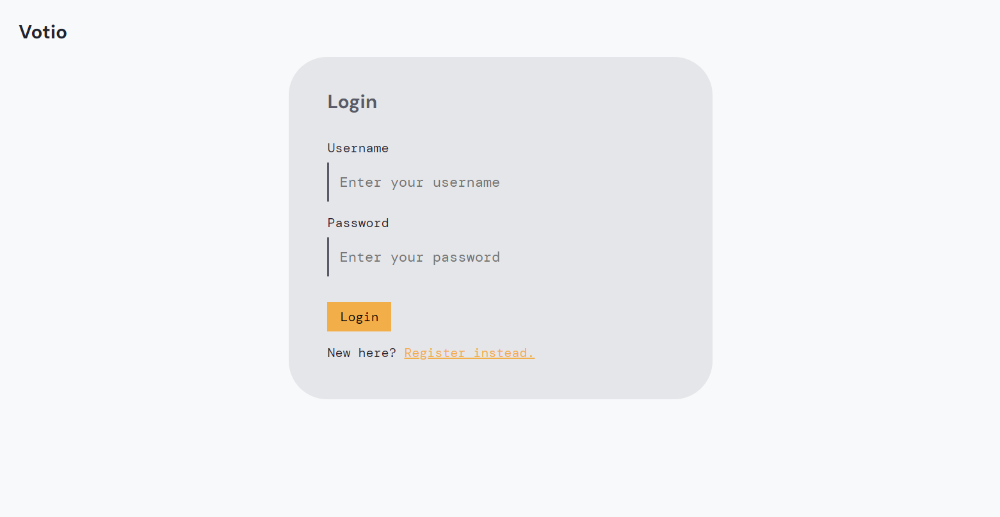
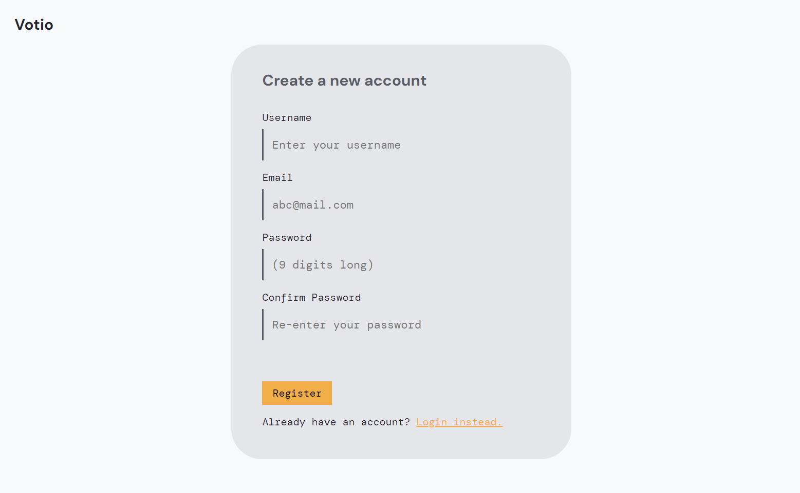
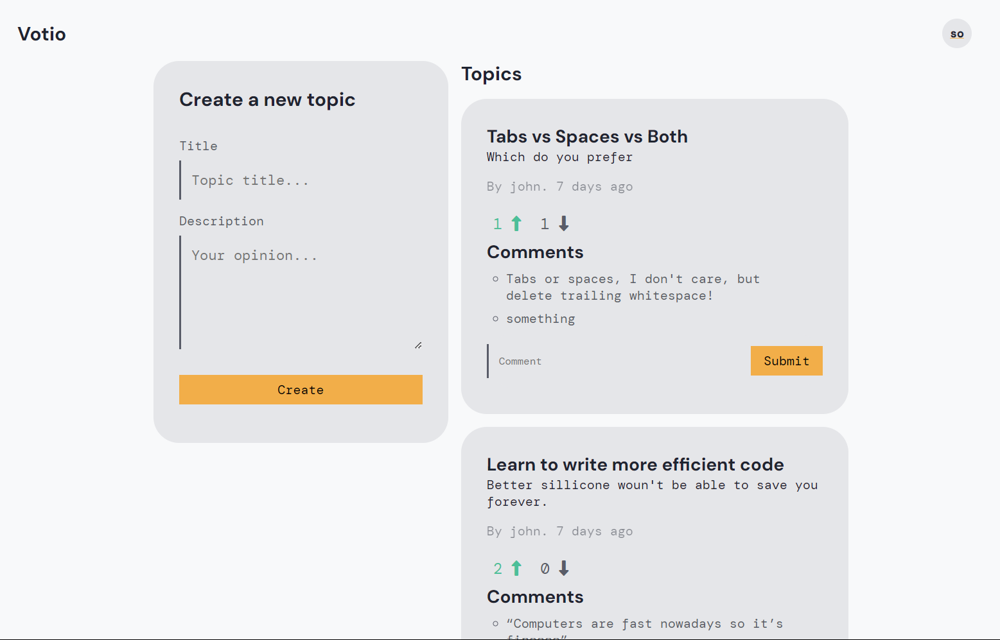
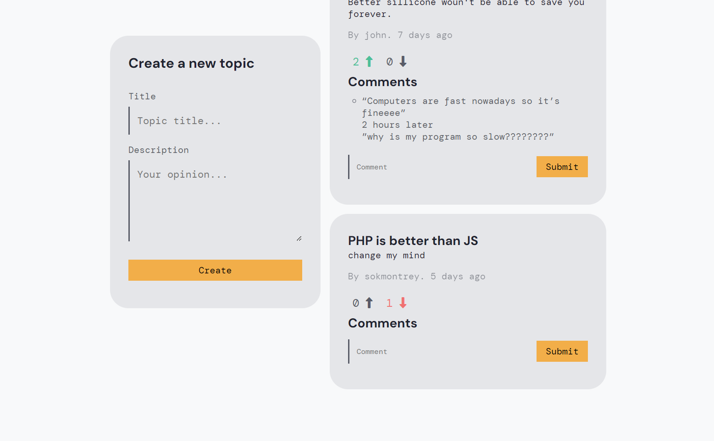
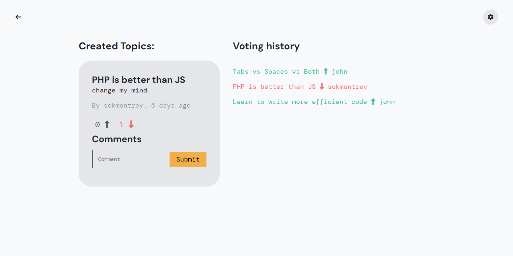
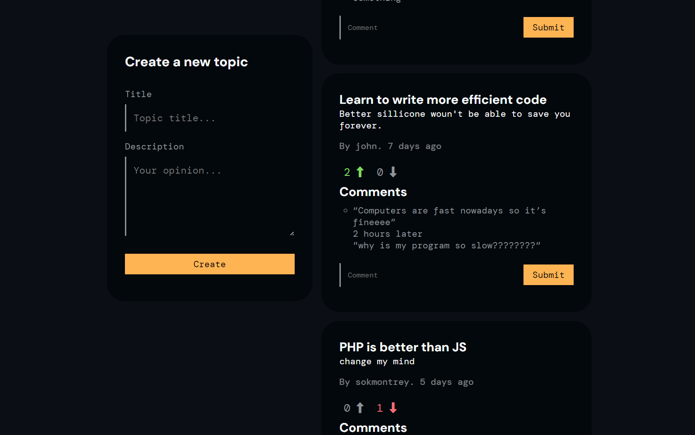
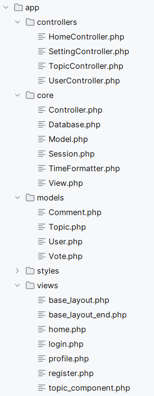

# Votio
Just like reddit but ... ehh. 

A PHP MVC application for college assignment (GBC Comp1230 - PHP dev).

# Installation
nah. 

Don't forget to set up your database if you decide to run this.

Also create db.config.php file (check `Database.php`)

# Screenshorts

## Login & Registration page

---

## Home page

## Profile page

## Dark theme

## File structure

# Explaination

[Unlisted YouTube Video](https://youtu.be/PGhyO01wZz4)

I'm finishing my semester in a week anyway so the ftp server credentials will be resetted and won't work.
